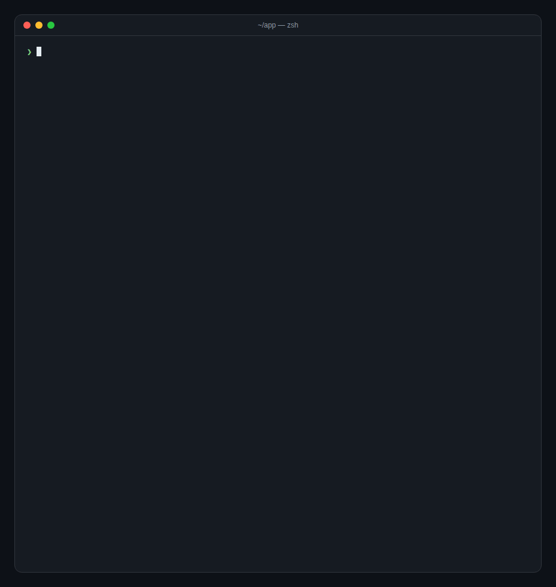

<div align="center">

<picture>
  <source media="(prefers-color-scheme: dark)" srcset="docs/banner-dark.svg">
  
</picture>

**An independent AI model, or a jury of them, reviews the code your AI wrote *before* you accept it.**

<sub>Works with Cursor · Copilot · Claude Code · Codex · Aider · plain git — reviewers: Codex · Gemini · Claude · local models via Ollama</sub>

[](LICENSE)
[](https://www.python.org)
[](#)
[](https://code.claude.com)
[](https://github.com/karhuzin-lgtm/crosscheck/actions/workflows/tests.yml)
[](#ci-and-code-scanning)

[Try it](#try-it-in-10-seconds) · [Jury mode](#jury-mode) · [Local models](#local-models-ollama) · [Security model](#security-model) · [Architecture](docs/ARCHITECTURE.md)

</div>

---

You let an AI write the code. Then the same model "checks" its own work, says "looks good!", and you hit accept. That's not a review — that's one AI grading its own homework.

**crosscheck** gets you a second opinion from an *independent* model. A **different** model (GPT via Codex, Gemini, or any CLI you point it at) reviews the diff, or a **jury** of several models reviews it at once. If they find a real problem, your commit is stopped, or your coding agent's turn is **blocked** and the findings go back to it to fix, before the work reaches you.

Local. No cloud. No account. No API keys of its own. Zero dependencies.

<p align="center"></p>
<p align="center"><sub>Recording of <code>crosscheck demo</code>, a simulated offline walkthrough. Real runs produce the same output.</sub></p>

## Try it in 10 seconds

No install, no keys, no models called:

```bash
uvx --from git+https://github.com/karhuzin-lgtm/crosscheck crosscheck demo
# or: pipx run --spec git+https://github.com/karhuzin-lgtm/crosscheck crosscheck demo
```

Then install it for real and check which reviewers you have:

```bash
pipx install git+https://github.com/karhuzin-lgtm/crosscheck
crosscheck doctor
```

You need **at least one reviewer** on your PATH: [`codex`](https://github.com/openai/codex) (recommended, because it runs write-sandboxed), [`ollama`](https://ollama.com) (local and free), `gemini`, or `claude`.

## Why

The most common complaint about AI coding is *"it's almost right, but not quite."* The subtle bug, the missed edge case, the security slip. A model reviewing its own output shares its own blind spots. A **second, independent** model doesn't. When two models from different vendors **both** flag the same line, that's almost never a false alarm.

## Use it everywhere

crosscheck reviews a **git diff**, so it doesn't care which tool wrote the code: Cursor, Copilot, Aider, Codex, Claude Code, or you.

```bash
crosscheck                       # review uncommitted changes (vs HEAD)
crosscheck --staged              # review what you're about to commit
crosscheck --base main           # review this branch like a PR
git diff | crosscheck -          # review any diff from stdin
crosscheck --json                # machine-readable, for scripts and CI
```

Exit codes: `0` pass · `1` blocking findings · `2` usage error (or a reviewer failure with `--strict`).

**On every commit:**

```bash
crosscheck install-hook          # writes .git/hooks/pre-commit (skip once: git commit --no-verify)
```

or with [pre-commit](https://pre-commit.com):

```yaml
- repo: https://github.com/karhuzin-lgtm/crosscheck
  rev: main
  hooks: [{ id: crosscheck }]
```

**Inside Claude Code**, the agent can't even finish its turn until the issues are fixed (see [Claude Code plugin](#claude-code-plugin) below).

## Jury mode

One second opinion is good. Two independent ones that **agree** are better.

```bash
crosscheck --jury codex,gemini              # any juror can block
crosscheck --jury codex,gemini --quorum 2   # block only on issues both models flag
```

Every juror reviews the same (redacted) diff in parallel, and each one can pin its own model: `--jury codex:gpt-5,ollama:qwen2.5-coder:7b`. Findings that point at the same place and describe the same problem are merged, and each one shows **who flagged it**: `2/2 agree` or `only gemini`. Agreed findings sort first. Use `--quorum 2` when you want only high-confidence blocks. If a juror is missing or crashes, the rest still decide, and you're told. Set it permanently with `CROSSCHECK_JURY=codex,gemini`.

## Local models (Ollama)

No API account and no code leaving your machine:

```bash
ollama pull qwen2.5-coder:7b
crosscheck --provider ollama                       # default model: qwen2.5-coder:7b
crosscheck --provider ollama:deepseek-coder-v2     # any model you've pulled
crosscheck --jury codex,ollama                     # a cloud model and a local one
```

An Ollama reviewer is a plain text model with **no tools**: it can't read files or run commands. So, unlike `gemini`/`claude`, it needs no unsandboxed opt-in. `OLLAMA_HOST` is passed through if you run the server elsewhere.

## CI and code scanning

`--sarif` emits [SARIF 2.1.0](https://docs.oasis-open.org/sarif/sarif/v2.1.0/sarif-v2.1.0.html), so findings appear as annotations in GitHub code scanning, VS Code, and other SARIF viewers:

```yaml
# in a workflow where a reviewer CLI is installed and authenticated
- run: crosscheck --base origin/${{ github.base_ref }} --sarif > crosscheck.sarif || true
- uses: github/codeql-action/upload-sarif@v3
  with: { sarif_file: crosscheck.sarif }
```

`--json` gives a simpler shape for your own scripts: verdict, reviewers, and each finding with the models that flagged it.

## What has it caught for you?

crosscheck keeps a **local, counts-only** tally: no code, no paths, no finding text, nothing sent anywhere.

```bash
crosscheck stats                 # terminal card: issues caught, by severity/category/model, 14-day sparkline
crosscheck stats --badge         # README badge  →  crosscheck | 37 issues caught
crosscheck stats --svg card.svg  # shareable card (light/dark aware) for your README or a post
```

Turn it off with `CROSSCHECK_STATS=0`; wipe it with `crosscheck stats --reset`.

## How it works

```
  your AI finishes a change  /  you run `git commit`  /  you run `crosscheck`
            │
            ▼
   ┌──────────────────┐     git diff of the change
   │    crosscheck    │ ──────────────────────────────┐
   └──────────────────┘        secrets redacted        ▼
            │                              ┌───────────────────────┐
            │      findings (JSON), merged │  independent reviewer  │
            │      across jurors, redacted │  or a jury: codex,     │
            │ ◀────────────────────────────│  gemini, ... parallel  │
            ▼                              └───────────────────────┘
   issues ≥ threshold (and ≥ quorum jurors)?
            │ yes → block the turn / fail the commit, with findings to fix
            │ no  → pass ✓   (local tally updated)
```

When crosscheck blocks inside Claude Code, your agent sees exactly what to fix:

```
crosscheck: a jury of independent reviewers (codex, gemini) found 1 issue(s) that should be addressed before finishing:

[BLOCKER] auth/session.py:42 — off-by-one lets an expired token pass one extra request (flagged by codex, gemini)
  `<=` should be `<`; at exactly expiry the check succeeds and the stale token is accepted once more.

Fix the issues above, then finish. (crosscheck round 1/2)
```

## Claude Code plugin

crosscheck is also a standard Claude Code plugin: a Stop hook that runs the same review whenever the agent finishes a turn that changed code.

```
/plugin marketplace add karhuzin-lgtm/crosscheck
/plugin install crosscheck@crosscheck
```

**Manual (any agent that supports hooks):** point a `Stop` hook at the gate in your `.claude/settings.json`:

```json
{
  "hooks": {
    "Stop": [
      { "hooks": [ { "type": "command", "command": "/abs/path/to/crosscheck/scripts/crosscheck-gate" } ] }
    ]
  }
}
```

That's it. The next time your agent finishes a change, the reviewer runs.

## Configure

Zero-config by default (`auto` reviewer, blocks on `warn`+). Override with `CROSSCHECK_*` env vars, CLI flags (`crosscheck --help`), or, within the limits below, a `.crosscheck.json` in your project.

| Key | Env | Default | What it does |
|---|---|---|---|
| `provider` | `CROSSCHECK_PROVIDER` | `auto` | `auto` (→ `codex`, write-sandboxed), `codex`, `gemini`, `claude`, `ollama`, or `command`. Append `:model` to pin a model, e.g. `ollama:llama3.1:8b` |
| *(env-only)* | `CROSSCHECK_MODEL` | *(cli default)* | Pin the model of a **single** reviewer (in jury mode use `name:model` per juror). **Env-only**: a `model` in a project file is ignored |
| `threshold` | `CROSSCHECK_THRESHOLD` | `warn` | Minimum severity that blocks: `nit` \| `warn` \| `blocker` |
| `max_rounds` | `CROSSCHECK_MAX_ROUNDS` | `2` | (Claude Code hook) How many times it will block+re-review before letting you through (env-only) |
| `fail_open` | `CROSSCHECK_FAIL_OPEN` | `true` | If the reviewer errors, allow the turn (never wedge your session) |
| `timeout_sec` | `CROSSCHECK_TIMEOUT` | `120` | Reviewer time budget (env-only) |
| `max_diff_bytes` | `CROSSCHECK_MAX_DIFF_BYTES` | `200000` | How much of the diff is reviewed (env-only) |
| *(env-only)* | `CROSSCHECK_JURY` | *(off)* | Comma-separated jurors, e.g. `codex,gemini` (max 4). Same as `--jury` |
| *(env-only)* | `CROSSCHECK_QUORUM` | `1` | Jurors that must flag an issue for it to block. Same as `--quorum` |
| *(env-only)* | `CROSSCHECK_STATS` | `true` | Keep the local counts-only tally for `crosscheck stats` |
| `enabled` | `CROSSCHECK_ENABLED` | `true` | Master switch |
| `include` | `CROSSCHECK_INCLUDE` | `*` | Comma-separated globs of paths to review (env/global only — see below) |
| `exclude` | `CROSSCHECK_EXCLUDE` | *(vendored dirs, lockfiles, binaries…)* | Comma-separated globs to skip; env value **extends** the defaults |
| *(opt-in)* | `CROSSCHECK_ALLOW_UNSANDBOXED` | *(off)* | Set `1` to permit the un-sandboxed `gemini`/`claude` reviewers at all |
| *(opt-in)* | `CROSSCHECK_ALLOW_COMMAND` | *(off)* | Set `1` to honor a `command` supplied by a project file |

Custom reviewer? Use the `command` provider — crosscheck pipes the prompt to stdin and reads your command's stdout. Supply it via the **env var** (trusted) so a cloned repo can't inject the command it runs:

```bash
CROSSCHECK_PROVIDER=command CROSSCHECK_COMMAND="my-reviewer --json"
```

### What a project `.crosscheck.json` may and may not do

A `.crosscheck.json` can arrive checked into a **cloned repo you don't control**, so crosscheck treats it as **untrusted**: it may only ever move the gate in the *strengthening* direction. Relative to your env/default baseline, a project file **can** turn the gate on, **lower** the threshold (stricter), and pick `auto`/`codex` as the provider. It **cannot**:

- disable the gate (`enabled: false` is ignored),
- raise the threshold above your baseline,
- change the resource budgets: `max_rounds`, `timeout_sec` and `max_diff_bytes` in the project file are **ignored entirely**. Raising them is a cost/DoS vector, and lowering them weakens the gate (a hostile `timeout_sec: 1` forces a fail-open bypass, and `max_diff_bytes: 1000` truncates the diff away),
- change fail-open in either direction (`fail_open` is ignored),
- enlist extra jurors, change the quorum, or turn off stats (`jury`/`quorum`/`stats` are ignored),
- pick the reviewer **model** — a `model` in the project file is **ignored entirely**; it comes only from `CROSSCHECK_MODEL`,
- supply the reviewer **command** — a `command` in the project file is **ignored entirely**; it comes only from `CROSSCHECK_COMMAND`,
- select `gemini`/`claude`/`command` — a project file may only request `auto` or `codex` (the recommended write-sandboxed reviewer); any other value is **ignored**, not an error,
- shrink review coverage: `include`/`exclude` from the project file are **ignored entirely**. Put vendored-dir excludes in `CROSSCHECK_EXCLUDE` / your global config, not the repo file.

`gemini`/`claude` (no OS sandbox here) require `CROSSCHECK_ALLOW_UNSANDBOXED=1` **and** an env-set provider; without the opt-in, a request for them from any source silently falls back to `auto` (codex-only).

## Security model

crosscheck processes an **untrusted diff** and an **untrusted `.crosscheck.json`** (both can arrive checked into a cloned repo you don't control). Here is precisely what it defends and what it does not — an honest threat model is a feature, not an apology.

- **Secrets are redacted on the way out *and* on the way back.** The diff is scanned and credential-shaped content (private keys, `sk-…`, GitHub/AWS/Google/Slack tokens, `KEY=…` assignments) is masked **before** it is sent to the reviewer. The reviewer's **output** — and any **error text** from a reviewer that crashes — is run through the same masks **before** it reaches your terminal or a block reason. If anything is redacted either way, you're told. Redaction is pattern-based: it's a strong filter for common secret shapes, not a guarantee for unusual ones.
- **The reviewer is a trusted, user-installed, authenticated CLI that crosscheck executes.** crosscheck runs it with a sanitized environment (ambient credentials dropped), a neutral working directory, and its binary resolved to an absolute path so a repo can't shadow it. `codex` additionally runs under its **`--sandbox read-only`** policy, so it cannot write.
- **crosscheck does NOT sandbox the reviewer's filesystem *reads*.** `codex` can still *read* local files, and `$HOME` is passed through so its own config/auth works. A crafted prompt-injection embedded in a diff you choose to review could therefore induce the reviewer to read a local file (e.g. `~/.ssh/…`) and try to surface it; the in+out redaction masks common secret shapes but is **not containment**. Treat the reviewer as processing untrusted input. For fully untrusted diffs, prefer `codex` (it at least runs write-sandboxed, so a compromised reviewer can't also modify your files) over the un-sandboxed `gemini`/`claude` ones (no OS isolation at all — gated behind an explicit `CROSSCHECK_ALLOW_UNSANDBOXED=1` opt-in for that reason). Neither path is a read-privacy boundary. **A real OS sandbox (bwrap / user-namespace / container) is intentionally out of scope for a stdlib-only, cross-platform v0.1 — it's unavailable and untestable on typical hosts.**
- **The untrusted project `.crosscheck.json` can only *strengthen* the gate.** It can enable it and lower the threshold. It can **never** weaken or disable it, touch the resource budgets or fail-open, pick the reviewer **model** or **command**, configure the jury, or select an un-sandboxed provider (see the config section above).
- **Jury mode keeps every guarantee per juror.** Each juror gets the same redacted diff, each juror's output is redacted before use, and un-sandboxed jurors still need `CROSSCHECK_ALLOW_UNSANDBOXED=1`.
- **Stats are counts only.** The tally file holds numbers (reviews, severities, categories, reviewer names) and never code, paths or finding text.
- **Fail-open by default.** A missing CLI, a timeout, or unparseable output never blocks you — crosscheck warns and steps aside. Flip `fail_open: false` for a strict gate.
- **No telemetry, no network of its own.** The only outbound call is to the reviewer CLI you already use.
- **It can't loop forever.** After `max_rounds` it steps aside (and Claude Code independently caps consecutive blocks).

## FAQ

**Does it slow me down?** Only on changes with code in them, and only for as long as one review takes (jurors run in parallel). Clean diffs pass quietly.

**Won't it block on trivia?** The reviewer is told to be conservative and flag only real problems introduced by the diff. Tune `threshold` to taste (`blocker` = only the serious stuff).

**Can the reviewer be Claude too?** Yes, but `claude` (like `gemini`) runs without an OS sandbox, so it's gated behind `CROSSCHECK_ALLOW_UNSANDBOXED=1` and set via env — and you'll get a same-vendor warning, since the whole point is a *different* model. Install `codex` for a write-sandboxed, cross-model second opinion.

**Does it work outside Claude Code?** Yes. The `crosscheck` CLI reviews any git diff, whatever wrote it, and `crosscheck install-hook` puts it on every commit. The Stop hook is a plain stdin/stdout contract that other agents with completion hooks can use too.

**Is the demo real?** `crosscheck demo` is a simulated, offline walkthrough so you can see the output without installing a reviewer. It says so when it runs, and it never records stats.

## Contributing

Issues and PRs are welcome, new reviewer adapters especially. Start with [CONTRIBUTING.md](CONTRIBUTING.md) and the [architecture guide](docs/ARCHITECTURE.md). Security reports go through [SECURITY.md](SECURITY.md).

## License

MIT © [Aleksei](https://github.com/karhuzin-lgtm)
